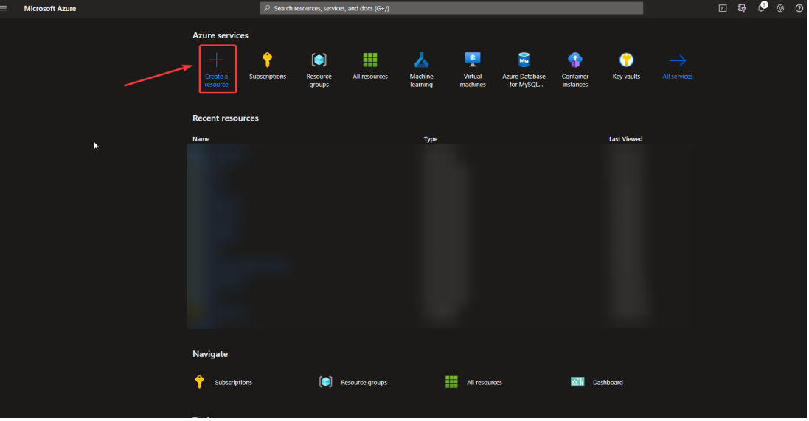
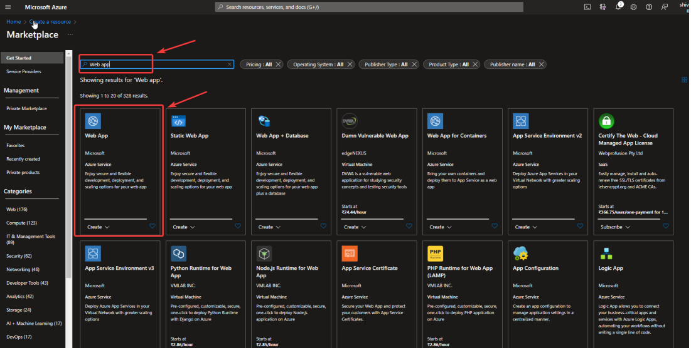

# Cat-Dog-Classification

## How to Run

1. conda create -n catdog python=3.7 -y
2. conda activate catdog
3. pip install -r requirements.txt
4. python app.py
5. open in browser: http://localhost:8080/

# Azure Deployment

### Click on Create <\br>

